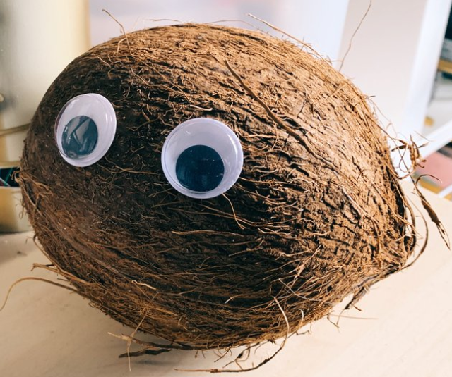

# ChaRL

> "You wanna get _nuts_?  Let's get **coconuts**!" - Bruce Wayne to his personal shopper

## Resources:

### RL Learning:
- [Reinforcement Learning Leactures](https://www.youtube.com/playlist?list=PLqYmG7hTraZBKeNJ-JE_eyJHZ7XgBoAyb "YouTube Playlist") by DeepMind (2018)
- [_Reinforcement Learning_](http://incompleteideas.net/book/RLbook2020.pdf "Reinforcement Learning Textbook") by R.S. Sutton & A.G. Barto (2020)

### Basic RL Frameworks:
- Kerasians: [Keras RL](https://github.com/keras-rl/keras-rl "Keras RL") by M. Plappert (2016-)
- PyTorchers: [Spinning Up in Deep RL](https://spinningup.openai.com/en/latest/ "Spinning Up") by Open AI (2018-2020)

### Environments:
- [OpenSpiel](https://github.com/deepmind/open_spiel "OpenSpiel") by DeepMind (2019-)

### Lagniappe:
- [Charl's Channel](https://www.youtube.com/channel/UCF1fG3gT44nGTPU2sVLoFWg "Patrick F Willems on YouTube")

